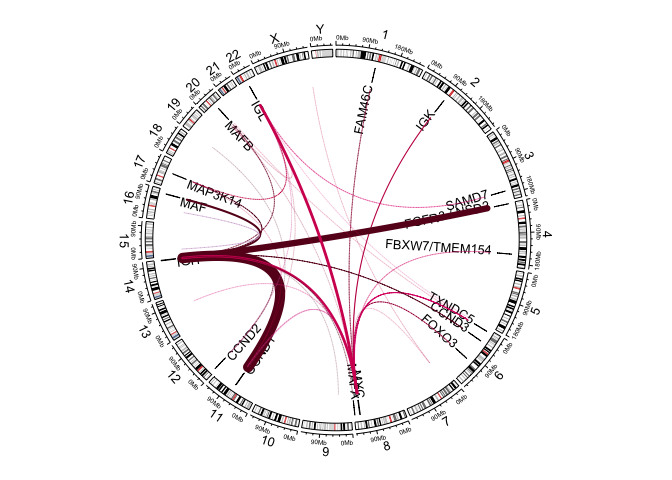

Load CoMMpass public delly output


```r
MMRF.DELLY <- read.delim("../../../MMRF_IA15/CoMMpass_IA15a_WGS_WXS/MMRF_CoMMpass_IA15a_Delly_Structural_Calls.txt")
```

Cluster translocations within a ~100,000 bp window from cluster border 


```r
all.potential.contigs <- unique(c(MMRF.DELLY$CHR2, MMRF.DELLY$CHROM))
chromosomes <- c(1:22, "X", "Y")
sectors <- paste0("chr", chromosomes)

# cluster all translocations in (X,Y) plans
all.tx <- lapply(chromosomes, 
                 cluster.all.tx.from.chr, 
                 delly=MMRF.DELLY, 
                 minPts=2, 
                 eps=2E5,
                 chromosomes=chromosomes, 
                 min.unique.patients=2,
                 min.median.MAPQ=15,
                 min.median.PE=1,
                 min.median.SR=1)
```

```
## `summarise()` has grouped output by 'Chr_Cluster', 'IG_CHR'. You can override using the `.groups` argument.
## `summarise()` has grouped output by 'Chr_Cluster', 'IG_CHR'. You can override using the `.groups` argument.
## `summarise()` has grouped output by 'Chr_Cluster', 'IG_CHR'. You can override using the `.groups` argument.
## `summarise()` has grouped output by 'Chr_Cluster', 'IG_CHR'. You can override using the `.groups` argument.
## `summarise()` has grouped output by 'Chr_Cluster', 'IG_CHR'. You can override using the `.groups` argument.
## `summarise()` has grouped output by 'Chr_Cluster', 'IG_CHR'. You can override using the `.groups` argument.
## `summarise()` has grouped output by 'Chr_Cluster', 'IG_CHR'. You can override using the `.groups` argument.
## `summarise()` has grouped output by 'Chr_Cluster', 'IG_CHR'. You can override using the `.groups` argument.
## `summarise()` has grouped output by 'Chr_Cluster', 'IG_CHR'. You can override using the `.groups` argument.
## `summarise()` has grouped output by 'Chr_Cluster', 'IG_CHR'. You can override using the `.groups` argument.
## `summarise()` has grouped output by 'Chr_Cluster', 'IG_CHR'. You can override using the `.groups` argument.
## `summarise()` has grouped output by 'Chr_Cluster', 'IG_CHR'. You can override using the `.groups` argument.
## `summarise()` has grouped output by 'Chr_Cluster', 'IG_CHR'. You can override using the `.groups` argument.
## `summarise()` has grouped output by 'Chr_Cluster', 'IG_CHR'. You can override using the `.groups` argument.
## `summarise()` has grouped output by 'Chr_Cluster', 'IG_CHR'. You can override using the `.groups` argument.
## `summarise()` has grouped output by 'Chr_Cluster', 'IG_CHR'. You can override using the `.groups` argument.
## `summarise()` has grouped output by 'Chr_Cluster', 'IG_CHR'. You can override using the `.groups` argument.
## `summarise()` has grouped output by 'Chr_Cluster', 'IG_CHR'. You can override using the `.groups` argument.
## `summarise()` has grouped output by 'Chr_Cluster', 'IG_CHR'. You can override using the `.groups` argument.
## `summarise()` has grouped output by 'Chr_Cluster', 'IG_CHR'. You can override using the `.groups` argument.
## `summarise()` has grouped output by 'Chr_Cluster', 'IG_CHR'. You can override using the `.groups` argument.
## `summarise()` has grouped output by 'Chr_Cluster', 'IG_CHR'. You can override using the `.groups` argument.
## `summarise()` has grouped output by 'Chr_Cluster', 'IG_CHR'. You can override using the `.groups` argument.
## `summarise()` has grouped output by 'Chr_Cluster', 'IG_CHR'. You can override using the `.groups` argument.
```

```r
all.tx.df <- all.tx %>% map_df(.f = ~.x[[1]])
all.clusters <- all.tx %>% map_df(.f = ~.x[[2]])
all.bed1 <- all.tx %>% map_df(.f = ~.x[[3]]) %>% mutate(value1=IG_CHR, value2=1)
all.bed2 <- all.tx %>% map_df(.f = ~.x[[4]]) %>% mutate(value1=PARTNER_CHR, values2=1)
all.regions.for.circos <- rbindlist(list(all.bed1, all.bed2), use.names = FALSE)
bound.beds <- cbind(all.bed1, all.bed2)
```

# Plot clusters


```r
circos.clear()
circos.par("track.height" = 0.1, start.degree = 90)

specie.info <- read.chromInfo(species = "hg19")$df
specie.info$chr.centers <- apply(specie.info[,c(2, 3)], 1, mean)

# circos.genomicInitialize(data = specie.info, plotType = c("labels", "Ideogram"), sector.names = chromosomes)

circos.initializeWithIdeogram(species = "hg19",  track.height = convert_height(2, "mm"), c("ideogram", "labels"))

circos.genomicTrack(trx.annot, ylim=c(0, 0.1),  
                    panel.fun = function(region, value, ...) {
                      circos.genomicRect(region, value, ytop = 0.1, ybottom = 0,...)
                      circos.genomicText(region, value, y=0, labels.column = 1, facing = "clockwise", niceFacing = TRUE, cex=0.8, padding = 0, adj=degree(1.05), ...)
                    }, bg.border = NA )
```

```
## Note: 1 point is out of plotting region in sector 'chr1', track '3'.
## Note: 1 point is out of plotting region in sector 'chr1', track '3'.
```

```
## Note: 1 point is out of plotting region in sector 'chr2', track '3'.
## Note: 1 point is out of plotting region in sector 'chr2', track '3'.
```

```
## Note: 1 point is out of plotting region in sector 'chr3', track '3'.
## Note: 1 point is out of plotting region in sector 'chr3', track '3'.
```

```
## Note: 2 points are out of plotting region in sector 'chr4', track '3'.
## Note: 2 points are out of plotting region in sector 'chr4', track '3'.
```

```
## Note: 3 points are out of plotting region in sector 'chr6', track '3'.
## Note: 3 points are out of plotting region in sector 'chr6', track '3'.
```

```
## Note: 2 points are out of plotting region in sector 'chr8', track '3'.
## Note: 2 points are out of plotting region in sector 'chr8', track '3'.
```

```
## Note: 1 point is out of plotting region in sector 'chr11', track '3'.
## Note: 1 point is out of plotting region in sector 'chr11', track '3'.
```

```
## Note: 1 point is out of plotting region in sector 'chr12', track '3'.
## Note: 1 point is out of plotting region in sector 'chr12', track '3'.
```

```
## Note: 1 point is out of plotting region in sector 'chr14', track '3'.
## Note: 1 point is out of plotting region in sector 'chr14', track '3'.
```

```
## Note: 1 point is out of plotting region in sector 'chr16', track '3'.
## Note: 1 point is out of plotting region in sector 'chr16', track '3'.
```

```
## Note: 1 point is out of plotting region in sector 'chr17', track '3'.
## Note: 1 point is out of plotting region in sector 'chr17', track '3'.
```

```
## Note: 1 point is out of plotting region in sector 'chr20', track '3'.
## Note: 1 point is out of plotting region in sector 'chr20', track '3'.
```

```
## Note: 1 point is out of plotting region in sector 'chr22', track '3'.
## Note: 1 point is out of plotting region in sector 'chr22', track '3'.
```

```r
circos.genomicLink(region1 = all.bed1, 
                   region2 = all.bed2, 
                   col = vaf_col(all.clusters$mVAF), 
                   lwd = all.clusters$N_Unique_Patients*10*1/max(all.clusters$N_Unique_Patients))
```

<!-- -->

